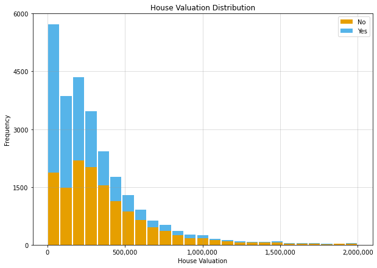
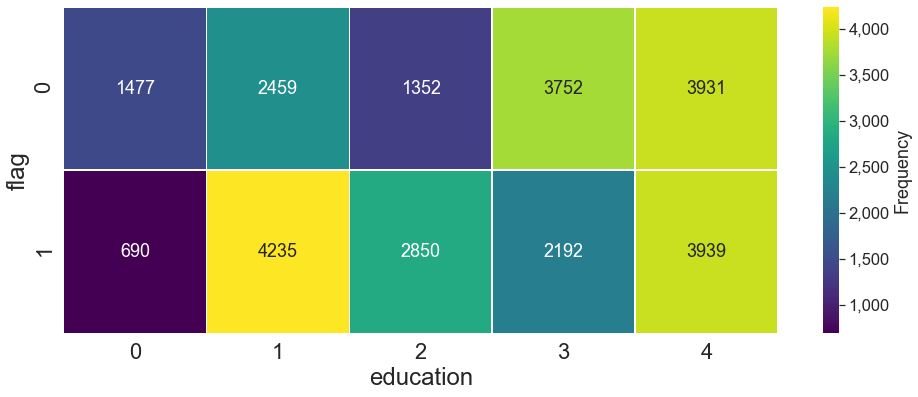
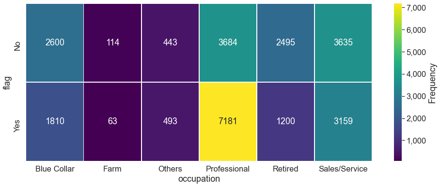
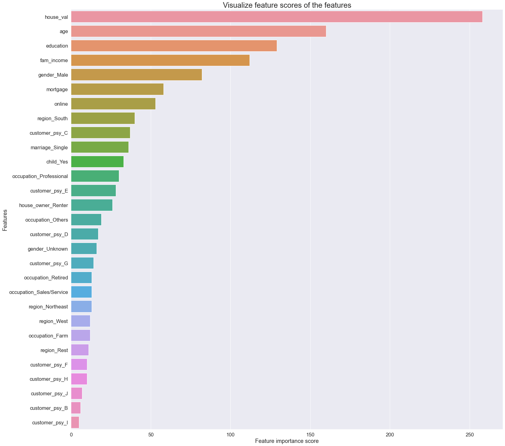

# Increasing-Product-Sales

# Business Understanding

### Background

Our company sold an automotive product for over 20 years. However, for the last 5 years the monthly average profit has been constant and did not gain any significant growth since the number of sales are remain stagnant as well. The condition will remain the same in the future if we do not do something. We have a lot of customer leads that can be a potential buyer. However, with limited member of sales team, we don’t have enough resource to approach more customer. It would be very inefficient and wasting a lotof resource to target all the leads.

We want to be efficient instead of keep expanding the team, so we need another approach. With limited time and resources, we need to be able to quickly inspect and prioritize which customer is a potential buyer. We will also need to formally research on what makes them buy our products. By doing this, we can achieve higher or the same amount of profit with cheaper cost.
**In summary, our business problem is:**
- We have stagnant profit because the number of sales is constant
- There are a lot of customer leads but we can’t reach all of them
- We need to know which customer leads that should be prioritized
- We need lead scoring so that we can be efficent on targeting potential buyer

### Business Goals and KPI
The business goal is determined together with other department. This part should be the continuation of the background problem.
- Gain insight on what drives people to buy our product
- Increase profit by 10% year over year
- Reduce annual marketing cost by 10%

### Data Mining Goals and KPI
The data mining goal is determined by the data mining team and is a translation from the business goals.
- Build predictive model with 75% accuracy
- Build predictive model with 75% recall
- Build predictive model with 75% precision

# Data Understanding
On the Data Understanding phase, we will gather, describe and explore the data to make sure it fits the business goal.
The deliverable or result of this phase should include:
- Data description
- Early data exploration report
- Data quality report

# Data Preparation

On the Data preparation phase, we will prepare and cleanse the data so they are fit for analysis and
making prediction. Some people said that the data preparation take 80% of the data mining process.
The deliverable or result of this phase should include:
- Data preparation steps (Cleansing, Typo Fixing, Duplicate Check, Encoding)
- Final data for modeling

# Exploratory Data Analysis (EDA)
**1. House Valuation Distribution**

**2. Education Level Frequency**

**3. Occupation Frequency**

# Modelling
On the Modeling phase, we will start creating model to find pattern inside our data and to make future
prediction for business purpose.

The deliverable or result of this phase should include:

- Modeling Technique and assumption
- Model Description
- Model Evaluation

### I. Cross Validation

The cross-validation step is where we will split our data into 2 separate dataset: training dataset and testing
dataset.

- Training Dataset: Dataset that will be used to train the machine learning model
- Testing Dataset: Dataset that will be used to evaluate the performance of the model.

Why do we need to separate the data? Because the model will always perform better in the data that
they’ve trained with.

### II. Model Fitting
Here, we fit or train the model using the data train. We will use 3 different models: **Decision Tree, 
Random Forest, and LGBM**. I also include the **SVM** model for additional. Later, we will evaluate both models and compare the outcome. eventually we will choose only the best model based on the final score

### III. Feature Importance

# Evaluation

On the **Evaluation phase**, we will further evaluate the model into the context of the business problem.
The deliverable or result of this phase should include:
- Model business assesment
- Review of the overal process
- Possible action and final decision

### Cost and Benefit Analysis

- **True Positive (TP)**: If the model predict customer **will buy** and the prediction is correct **(customer actually buy)**, we will get a profit of 400 (1000 revenue - 600 cost)

- **False Positive (FP)**: If the model predict customer **will buy** and the prediction is incorrect **(customer not buy)**, we will lost 600

- **True Negative (TN)**: If the model predict customer **will not buy** and the prediction is correct **(customer not buy)**, nothing happened

- **False Negative (FN)**: If the model predict customer **will not buy** and the prediction is incorrect **(customer buy)**, nothing happened

We will prioritize the customer that has the highest probability to buy our product. Thus, first we make a
list of a high scoring customer.

And we calculate for how many profit we will get if we target and approach only some percent of the total
customer? For example, if we only target the top 10 customer and ignore the rest, we have correctly predict
6 customer as buy and only a single incorrect prediction (the actual buying decision is on the truth column).
Thus, our profit would be:

#### 
 Profit = 6 × 400 + 2 × (−600) = 1200 (LGBM Model)
#### 
 Profit = 6 × 400 + 2 × (−600) = 1200 (Random Forest Model)
#### 
 Profit = 6 × 400 + 2 × (−600) = 1200 (Decision Tree Model)

Since we have 0 cost and 0 benefit for negative prediction, we can skip the calculation and our **final profit is
only a mere 1200**.

### Review Overal Process

The overal process of the data mining is quite smooth with some flaws that we find:
- Dirty or improper input data
- Underperforming model
- Data gathering is not done in real time yet

# Final Decision

After reviewing the project, there are some possible action for us to do:
- Improve the model before release them into the real use
- Release the model while also developing a better model
- Create a standardized data input procedure
- Present a full report of the data mining project
